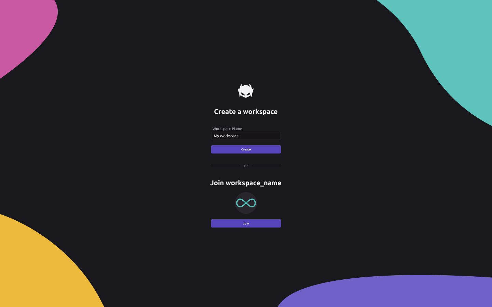

# Configuring your workspace

Your **workspace** is the root directory that contains all your tools that live on WayScript. Your workspace allows you to create and delete [Lairs](building-tools/lairs.md), the basic building block of WayScript, and manage team members.&#x20;

### Setting up your workspace

#### **Creating a workspace**

You can create a new workspace after registering your account with WayScript X. When using the WayScript X desktop app, you will then be directory to choose a workspace folder (see [File system](building-tools/file-system.md) for more details).


Workspace names must be unique. Please modify the name of your workspace if you cannot create one.


#### **Leaving a workspace**

Navigate to your workspace settings if you would like to leave your workspace. You must be part of a workspace to use WayScript X, so after leaving, you will be redirected to create or join a workspace.

#### **Joining a workspace**

If you have been invited to any existing workspaces, you can join the specified workspace instead of creating a a new one. Currently, you can only be a member of one workspace; you must leave your current workspace to join a new one.


You must have a network connection to create, leave, or join a workspace.


### Inviting a team member to your workspace

Navigate to your workspace settings to invite a team member by email address to your workspace. Your team member must register an account using the email address specified in the invite.


The WayScript team is developing additional workspace features such as active directory sync and workspace roles. Please contact us at [nihar@wayscript.com](mailto:nihar@wayscript.com) if you would like to request early access.

