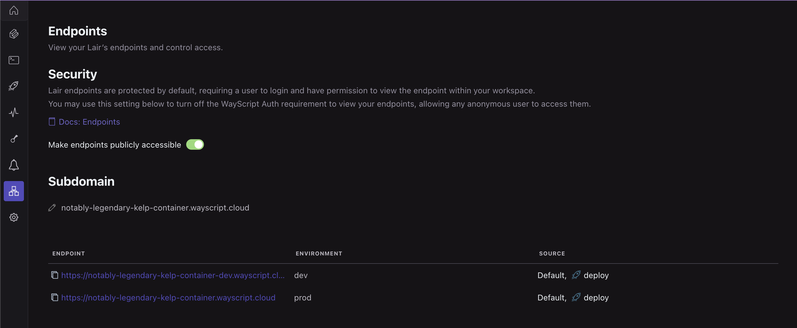
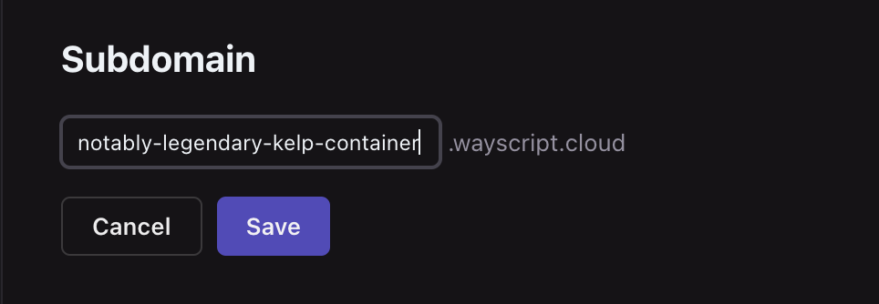

# Endpoints

When certain [triggers](triggers.md) are added to your Lair, WayScript auto-generates custom endpoints to provide external access to your tool. By default, endpoints are unique to each Lair environment (see [deployments.md](deployments.md "mention") for more details on environments) and protected to be only accessible by workspace members.&#x20;

### Making requests to protected endpoints

Requests to protected endpoints can be made in two ways:

* If the requests are made through a browser, they can be authenticated through WayScript's standard account credentials. As per standard session management, WayScript stores these credentials as cookies so subsequent requests do not require repeat entry of credentials.&#x20;
* If requests are made outside of the browser, they can be authenticated using a WayScript workspace member's application key. See details below on how to access and use your application key.

#### Accessing your application key

Your application key can be accessed by navigating to your workspace settings and selecting "Application Key". You can then view and/or copy your application key.&#x20;



Application keys are unique both per workspace member and per workspace (if the account is a member of multiple workspaces). If your application key is compromised, you can regenerated a new key, which will invalidate your old key. &#x20;


#### Making requests using application key

Requests made to protected Lair endpoints outside the browser must pass a workspace member's application key in the `Authorization` header as a bearer token.



```bash
$ curl -H 'Authorization: Bearer <Application Key>' '<Lair endpoint URL>'
```



```python
import requests

headers = {
    'Authorization': 'Bearer <Application Key>'
}
lair_endpoint_url = '<Lair endpoint>'

response = requests.get(lair_endpoint_url, headers=headers)
print(response.content)
```




If you receive a 403 response when accessing your endpoint, and are providing an `Authorization` header with a valid bearer token, try ensuring your request is sending a valid `User-Agent` header as well.


### Viewing your Lair's endpoints

Navigate to the 🔗 Endpoint tab in your Lair toolbar to view a list of all generated endpoints for your Lair.

<figure><figcaption></figcaption></figure>

#### Setting endpoints to be publicly accessible

Toggle the selector to allow public access to your Lair's generated endpoints.

### Changing Lair's Subdomain

When a lair is created, a unique subdomain is automatically assigned. This subdomain can be changed by clicking the "pencil" icon under the "Subdomain" header on the "Endpoints" tab.

<figure><figcaption><p>friendly names must be at least six characters long and follow url requirements</p></figcaption></figure>


Changing the subdomain will not update the production environment's endpoints until the lair is re-deployed.

