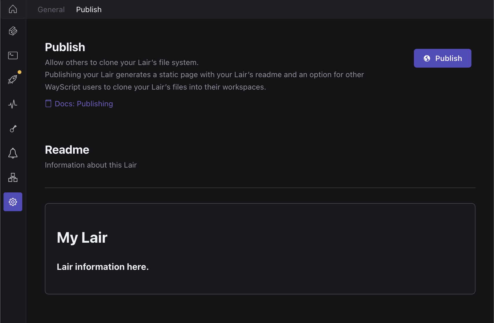

# Publishing

Your Lair can be published to share with publicly with external audiences. Once published, your Lair's file system can be cloned to a WayScript user's workspace with a single button.&#x20;

### Publishing your Lair&#x20;

With your lair open, navigate to the Settings (⚙) tab using the left toolbar. Then select the "Publish" at top. Click the "🌎 Publish” button to open the dialog.

<figure><figcaption></figcaption></figure>


Your Lair must be deployed to a production environment before it can be published, and on clone, your Lair's file system on its production environment will be shared. Please see [deployments.md](deployments.md "mention") for more details.&#x20;


