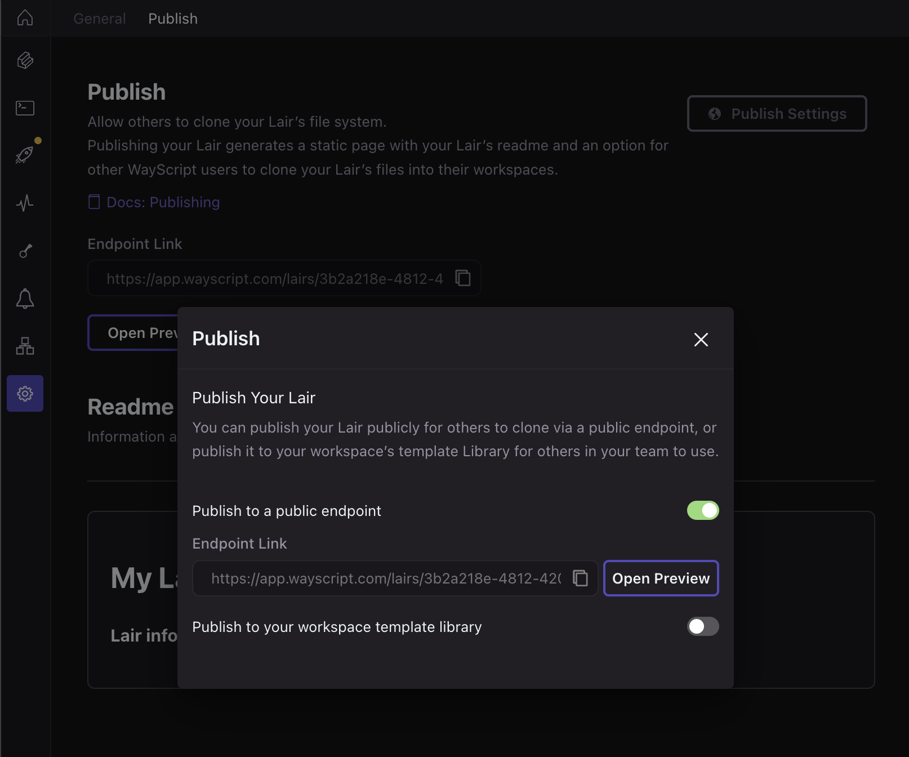
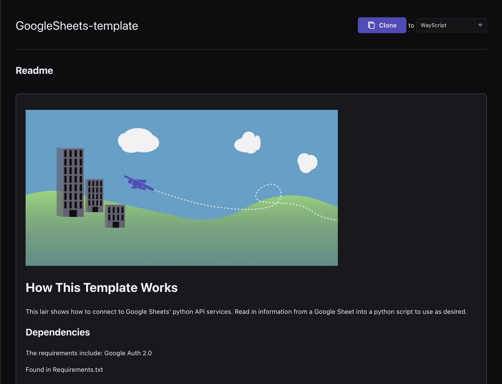

# Publish to Public Endpoint

<figure><figcaption></figcaption></figure>


Your Lair must be deployed to a production environment before it can be published, and on clone, your Lair's file system on its production environment will be shared. Please see [deployments.md](../deployments.md "mention") for more details.&#x20;


### Cloning a public lair

Navigate to a published Lair's endpoint to view its README, and clone the Lair to your workspace.

<figure><figcaption></figcaption></figure>
