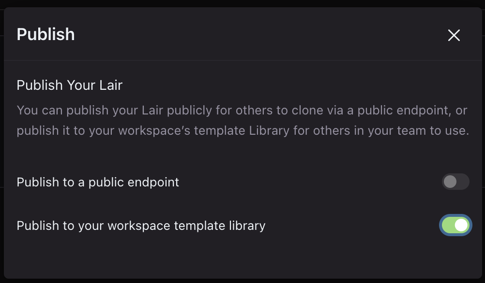
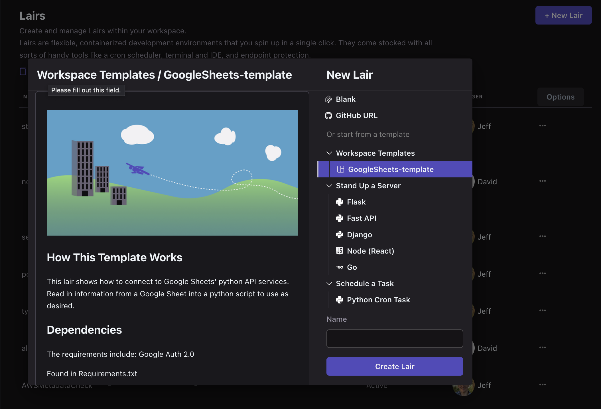

# Publish to Workspace

### How to publish

From the Publish dialog, toggle the option to "Publish to your workspace template library"

<figure><figcaption></figcaption></figure>


When a lair is published to your workspace template library, the reserved tag "template" is automatically added to your lair.


### Creating a Lair from a Workspace template

The Lairs that are published to your workspace will appear in the top section of the Lair creation modal.

<figure><figcaption></figcaption></figure>
