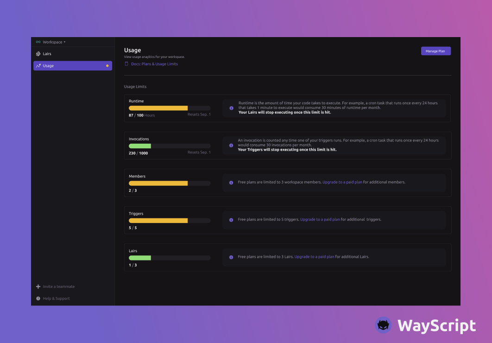

# Billing

### **The WayScript Pricing Model**

The pricing plans are determined by five usage components: runtime hours, invocations, triggers in a workspace, members in a workspace, and Lairs in a workspace. You can monitor your usage of all these components in the Usage view for each workspace.

### **Upgrading Your Plan**

You can upgrade your plan by clicking on your workspace name in the top left corner and navigating to Settings > Billing. Alternatively, you can click “Get more usage” from the top of the Usage view page.

<figure><figcaption></figcaption></figure>

### **Pricing Components Defined**

| Term                        | Definition                                                                                                                                                                                                                                                                                               |
| --------------------------- | -------------------------------------------------------------------------------------------------------------------------------------------------------------------------------------------------------------------------------------------------------------------------------------------------------- |
| **Runtime**                 | Monthly runtime hours is the total amount of time your scripts spend running. As an example, If you have a single HTTP endpoint that gets queried once per day and the script takes 5 seconds to run - that would be 150 seconds of runtime that month.                                                  |
| **Invocations**             | Invocations are the number of times a script is kicked off via a trigger. This includes cron triggers, deployments, and HTTP endpoints. If a script runs once a day on a cron trigger, that is 30 invocations per month. If an HTTP endpoint is queried once per hour, that is 24 invocations in a day.  |
| **Triggers in a Workspace** | The number of triggers in a workspace. These include Cron, HTTP, and Deploy triggers. Note, a trigger in both a development and production environment counts as a single trigger.                                                                                                                       |
| **Members**                 | The number of team members in a workspace.                                                                                                                                                                                                                                                               |
| **Lairs**                   | The number of unique Lairs created within a workspace.                                                                                                                                                                                                                                                   |
