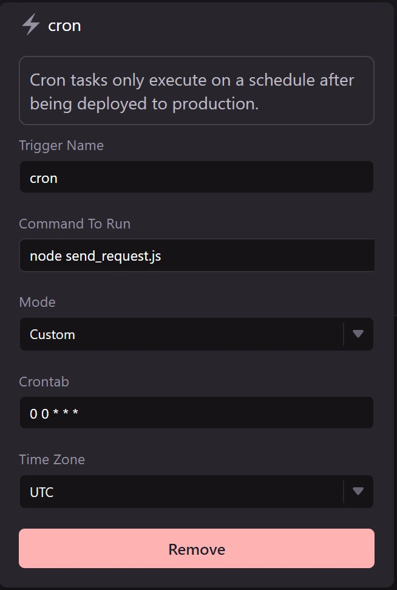

# Schedule a JavaScript cron task

WayScript allows you to configure your Lair to schedule task execution in minutes.

### Create `send_request.js`

Use the boilerplate code below to create a `send_request.js` file in your Lair’s root directory. See [File system](../../platform/lairs/file-system.md) for more details on how to manipulate files in your workspace file system.

#### Boilerplate `send_request.js`

```javascript
const https = require('https');

const options = {
  hostname: 'example.com',
  port: 443,
  path: '/todos',
  method: 'GET',
};

const req = https.request(options, res => {
  console.log(`statusCode: ${res.statusCode}`);

  res.on('data', d => {
    process.stdout.write(d);
  });
});

req.on('error', error => {
  console.error(error);
});

req.end();
```

### Configure `cron` trigger

Open your Lair’s `.triggers` file and add a new `cron` trigger. Create a name for your trigger, input the following run command, and set an interval or custom cron syntax for your task. See [Triggers](../../platform/lairs/triggers.md) for more details.

```
node send_request.js
```

###

<figure><figcaption></figcaption></figure>

### Test your task execution in development environment

Press “Run” to execute the run command and start your task’s process execution. Open your “Processes” list and select the running process to see the generated log.

### Deploy to production environment

Your task will not be scheduled within your Lair’s development environment. Once you have finished testing, press “Deploy” to create a production environment for your task. See [Hosted environments](../../platform/lairs/deployments.md) for more details.
