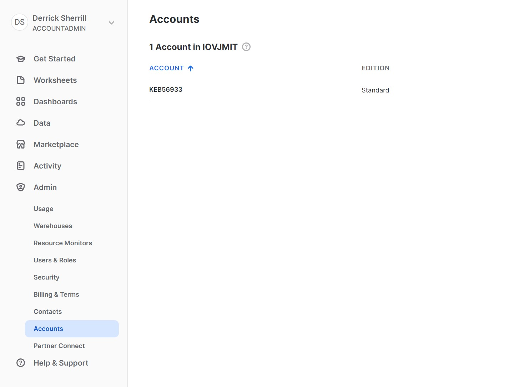
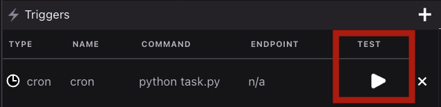

# Schedule Snowflake cron tasks

WayScript allows you to create connections to services and use their services all from within WayScript lairs.

### Create `query-snowflake.py`

Use the boilerplate code below to create an `query-snowflake.py` file in your Lair’s root directory. See [File system](../../platform/lairs/file-system/) for more details on how to manipulate files in your workspace file system.

Boilerplate `query-snowflake.py`

```python
import snowflake.connector
import os

# USER CREDENTIALS
USER = 'WAYSCRIPTDERRICK'
PASSWORD = os.environ.get('password')
ACCOUNT = 'IOVJMIT-KEB56933'

# The preferred account identifier includes the name of the account along with its organization (e.g. myorg-account123)
# Find this info in your dashboard > Admin ( Left side bar ) > Accounts
# The ORG will be listed at the top above all the accounts
# The account will be the value in the column 'ACCOUNT' for the account you wish to use. 

# Creates connection
conn = snowflake.connector.connect(
    user=USER,
    password=PASSWORD,
    account=ACCOUNT,
    )

## Executing SQL Commands:
# conn.cursor().execute("YOUR SQL COMMAND")

# Create a Warehouse
# conn.cursor().execute("CREATE WAREHOUSE IF NOT EXISTS tiny_warehouse_mg")

# Set Active Warehouse
conn.cursor().execute("USE WAREHOUSE COMPUTE_WH")

# Create a database
# conn.cursor().execute("CREATE DATABASE IF NOT EXISTS testdb")

# Set Active Database
conn.cursor().execute("USE DATABASE SNOWFLAKE_SAMPLE_DATA")

# Create Schema
# conn.cursor().execute("CREATE SCHEMA IF NOT EXISTS testschema")

# Set Active Schema
conn.cursor().execute("USE SCHEMA TPCDS_SF100TCL")

# Create a table
#conn.cursor().execute(
#    "CREATE OR REPLACE TABLE "
#    "test_table(col1 integer, col2 string)")

# Insert Data
#conn.cursor().execute(
#    "INSERT INTO test_table(col1, col2) "
#    "VALUES(123, 'test string1'),(456, 'test string2')")

# Query Data
#for (col1, col2) in conn.cursor().execute("SELECT INV_ITEM_SK, INV_QUANTITY_ON_HAND FROM INVENTORY"):
#	print('{0}, {1}'.format(col1, col2))

# Close Connection
conn.close()
```


See our [SDK](../../using-wayscript/sdk/) for more information on custom WayScript packages


### Requirements.txt

Boilerplate `requirements.txt`

```python
snowflake-connector-python[pandas]
```

More information on snowflake [documentation](https://docs.snowflake.com/en/user-guide/python-connector).

### Snowflake Credentials

To get the snowflake credentials for the above boilerplate code connections, you will need to visit your snowflake account

1. Account Username can be found by clicking your profile on the home screen selection:
2. Password is the password you use to sign in to that user account.
3. For the account, this will be a hyphenated pair of the organization and account. This information can be under admin > account. The organization value can be found at the top while the account will be the first value in each row in the user table.

<figure><figcaption><p>The organization here is IOVJMIT while the user is KEB56933</p></figcaption></figure>

For the example above, the account value would be `ACCOUNT = 'IOVJMIT-KEB56933'`

### Configure `cron` trigger

Open your Lair’s `.triggers` file and add a new `cron` trigger. Create a name for your trigger, input the following run command, and set an interval or custom cron syntax for your task. See [Triggers](../../platform/lairs/triggers.md) for more details.

```
python query-snowflake.py
```

### Test your task execution in the development environment

Press “Test” to execute the run command and start your task’s process execution. A process tab should open in your Terminal view.&#x20;

<figure><figcaption><p>Press Test in your Triggers view to test your cron Trigger. When ready, deploy it to production!</p></figcaption></figure>

### Deploy to a Production environment

Your task will not be scheduled within your Lair’s development environment. Once you have finished testing, Go to the [Deploy Panel](../../platform/lairs/deployments.md) to deploy a production instance of your task.&#x20;


In order for your scheduled task to run, you must [Deploy](../../platform/lairs/deployments.md) the lair!


### View Logs

[Logs](../../platform/lairs/logs.md) are automatically stored for both Development tests and Production runs of your task.&#x20;
