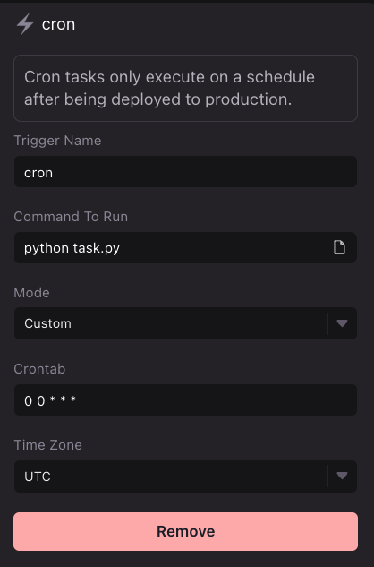

# Selenium Web Scraper

### Create `task.py`

Use the boilerplate code below to create a `task.py` file. See [File system](../../platform/lairs/file-system.md) for more details on how to manipulate files in your workspace file system.

#### Boilerplate `task.py`

```python
from selenium import webdriver
from selenium.webdriver.common.keys import Keys
from selenium.webdriver.common.by import By

options = webdriver.ChromeOptions()
options.add_argument('--headless')
options.add_argument('--no-sandbox')
options.add_argument('--disable-dev-shm-usage')
options.add_argument('user-agent=Mozilla/5.0 (Macintosh; Intel Mac OS X 10.10; rv:39.0) Gecko/20100101 Firefox/39.0')


driver = webdriver.Chrome(options = options)
driver.set_page_load_timeout(30)

# Take action on browser
driver.get("http://www.python.org")

# Request browser information
title = driver.title

#Establish Waiting Strategy
driver.implicitly_wait(0.5)

#Find an element
elem = driver.find_element(By.XPATH, '/html/body/div/div[3]/div/section/div[1]/div[1]/h2')
print(elem.text)

#end driver session
driver.quit()
```

### Configure `cron` trigger

Open your Lair’s `.triggers` file and add a new `cron` trigger. Create a name for your trigger, input the following run command, and set an interval or custom cron syntax for your task. See [Triggers](../../platform/lairs/triggers.md) for more details.

```
python task.py
```

<figure><figcaption><p>Example Cron Trigger Setup</p></figcaption></figure>

### Test your task execution in the development environment

Press “Test” to execute the run command and start your task’s process execution. A process tab should open in your Terminal view.&#x20;

<figure><figcaption><p>Press Test in your Triggers view to test your cron Trigger. When ready, deploy it to production!</p></figcaption></figure>

### Deploy to a Production environment

Your task will not be scheduled within your Lair’s development environment. Once you have finished testing, Go to the [Deploy Panel](../../platform/lairs/deployments.md) to deploy a production instance of your task.&#x20;


In order for your scheduled task to run, you must [Deploy](../../platform/lairs/deployments.md) the lair!


### View Logs

[Logs](../../platform/lairs/logs.md) are automatically stored for both Development tests and Production runs of your task.&#x20;

### Additional Notes

For additional notes on using headless browsers, please visit our [code snippets](../../resources/code-snippets/headless-browser-selenium.md) page.


[headless-browser-selenium.md](../../resources/code-snippets/headless-browser-selenium.md)

