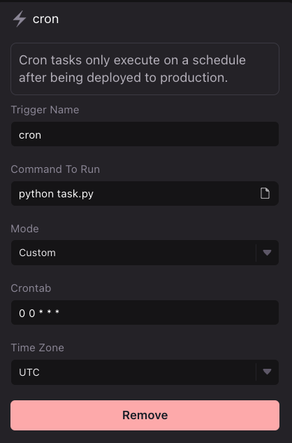

# Schedule SQL cron tasks

WayScript allows you to configure your [Lair](../../platform/lairs/) to schedule task execution in minutes.

### Create `task.py`

Use the boilerplate code below to create a `task.py` file in your [Lair’s](../../platform/lairs/) root directory. See [File system](../../platform/lairs/file-system/) for more details on how to manipulate files in your [workspace](../../platform/workspace/) file system.

#### Boilerplate task`.py`

```python
import os
import mysql.connector


# These credentials can be found via your database credentials page
# For additional help with these values, please visit the docs of where your database is hosted.
mydb = mysql.connector.connect(
  host='lcpbq9az4jklobvq.cbetxkdyhwsb.us-east-1.rds.amazonaws.com',
  user='srwmp6imz2v547os',
  password=os.environ.get('password'),
  port=3306,
  database='c9h0n4i2bk671ofb'
)

# SQL statement to execute 
sql = "SELECT * FROM earnings;"
mycursor = mydb.cursor()
mycursor.execute(sql)
myresult = mycursor.fetchall()
print(myresult)
```

#### Create a `requirements.txt` file:

```python
mysql-connector-python
```

### Configure `cron` trigger

Open your Lair’s `.triggers` file and add a new `cron` trigger. Create a name for your trigger, input the following run command, and set an interval or custom cron syntax for your task. See [Triggers](../../platform/lairs/triggers.md) for more details.

```
python task.py
```

<figure><figcaption><p>Example Cron Trigger Setup</p></figcaption></figure>

### Test your task execution in development environment

Press “Test” to execute the run command and start your task’s process execution. A process tab should open in your Terminal view.&#x20;

<figure><figcaption><p>Press Test in your Triggers view to test your cron Trigger. When ready, deploy it to production!</p></figcaption></figure>

Be sure to install your requirements.txt via your [terminal](../../platform/lairs/terminal.md).

```
pip install -r requirements.txt
pip freeze > requirements.txt
```

### Deploy to a Production environment

Your task will not be scheduled within your Lair’s development environment. Once you have finished testing, Go to the [Deploy Panel](../../platform/lairs/deployments.md) to deploy a production instance of your task.&#x20;


In order for your scheduled task to run, you must [Deploy](../../platform/lairs/deployments.md) the lair!


### View Logs

[Logs](../../platform/lairs/logs.md) are automatically stored for both Development tests and Production runs of your task.
