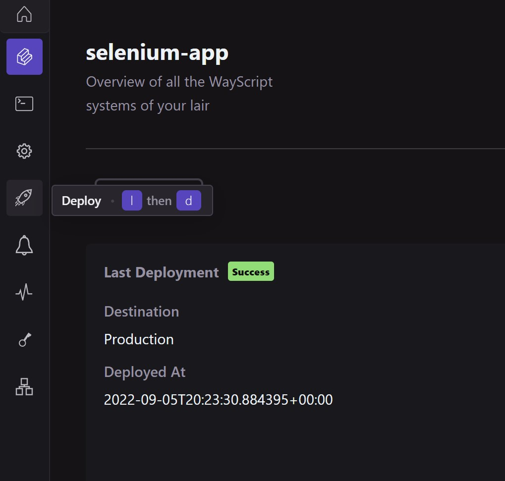
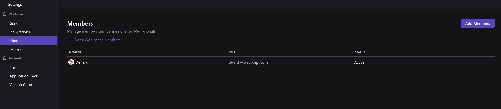

# Quickstart: Spin up a web server or framework

### **1) Create a workspace**

* Access WayScript at [app.wayscript.com](https://app.wayscript.com) or download the WayScript desktop app available for MacOS and Windows at [https://www.wayscript.com/downloads](https://wayscript.com/downloads).
* Enter a name for your workspace.&#x20;

The WayScript desktop app will create files on your local machine and sync them to a remote server. You be able to sync your files to a local directory if accessing WayScript from your browser. See [Configuring your workspace](../platform/workspace/) for more details on workspaces.&#x20;

### **2) Create a Lair**

[Lairs](../platform/lairs/) are preconfigured, containerized, and flexible development environments for your code.

* Inside your workspace, select “+ New Lair” to create your first Lair!

Now that you have created a Lair, follow one of our 5-minute tutorial to get started building tools on WayScript:


[build-an-api.md](../quickstart-webhook-microservice/build-an-api.md)



[schedule-a-task.md](../quickstart-schedule-task/python/schedule-a-task.md)



[host-a-flask-server.md](host-a-flask-server.md)



[set-up-fastapi-server.md](set-up-fastapi-server.md)


### **3)** Deploy a Lair &#x20;

* Once You have created a lair and built a tool, deploy your lair. Deploying affects different triggers and their functionality ( i.e. cron triggers only execute in deployed lairs )

<figure><figcaption></figcaption></figure>

* Click deploy twice more on the following interfaces to confirm the deployment of your lair.


Once deployed, triggers may activate or provide new production endpoints. For additional information on how deployment works with specific triggers, please view the [triggers page](../platform/lairs/triggers.md).



To avoid automatic Lair de-deployment, [subscribe to a paid plan](https://www.wayscript.com/pricing) or make sure to log into your WayScript account at least once every 3 months.&#x20;


### 4) Invite Teammates&#x20;

Workspaces can be shared with others. This allows them to access, edit, and use the applications within the workspace depending on their [collaborating permissions](../platform/workspace/members.md). To invite new members into your workspace:

* Access the home view of your workspace

<figure><figcaption></figcaption></figure>

* Select the drop down menu located next to your workspace name ( top left corner of the application )
* Select Settings&#x20;
* Then select members


An alternative hotkey to access workspace settings is `W` then `S`


* On the members page of your workspace settings, select "Add Members" in the top right corner
*

    <figure><figcaption>
( Purple Button in top right )
</figcaption></figure>
* Enter the emails of the members you would like to invite.

