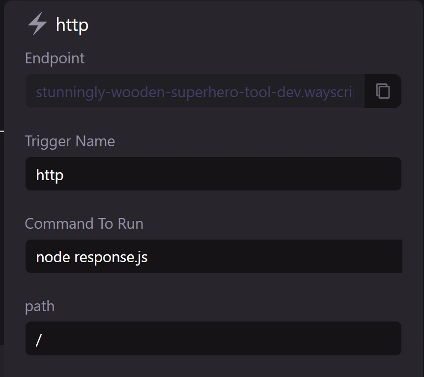

# Build a Microservice (Golang)

WayScript allows you to configure your Lair to build an serverless API endpoint in minutes.

### Create `response.js`

Use the boilerplate code below to create an `response.js` file in your Lair’s root directory. See [File system](../platform/lairs/file-system.md) for more details on how to manipulate files in your workspace file system.


#### Boilerplate `response.js`

```javascript
// Returns json response to http trigger
const wayscript = require("wayscript");

// Get payload for request event
let requestPayload = wayscript.context.getEvent()
// Parse header and request body from request payload
let requestHeader = requestPayload.data.headers
let requestBody = requestPayload.data.data

// Specify response payload
let data = {"hello": "world"};
let headers = {"content-type": "application/json"};
let status_code = 200;

// sends reponse
wayscript.http_trigger.sendResponse(data, headers, status_code);

```

### Configure `http` trigger

Open your Lair’s [Triggers Panel](../platform/lairs/triggers.md) and add a new `http` trigger. Create a name for your trigger and input the following run command. See [Triggers](../platform/lairs/triggers.md) for more details.

```bash
node response.js
```


If you are using the WayScript X desktop app, you must press "Push" to sync your new and modified files to remote (see [file-system.md](../platform/lairs/file-system.md "mention") or more details).


### Test your API in development environment

Navigate to the `*.wayscript.cloud` endpoint generated by your `http` trigger to see your simple API in action!

<figure><figcaption></figcaption></figure>

### Deploy to production environment

Once you have finished testing, press “Deploy” to create a production environment for your API. Select `<Lair_name>.prod` in the Lair selector menu and view the `http` trigger to access your API’s production endpoint. See [Hosted environments](../platform/lairs/deployments.md) for more details.


By default, your Lair's endpoints are protected against unauthenticated requests. See [endpoints.md](../platform/lairs/endpoints.md "mention") on how to public expose your endpoints or authenticate using your application key.

