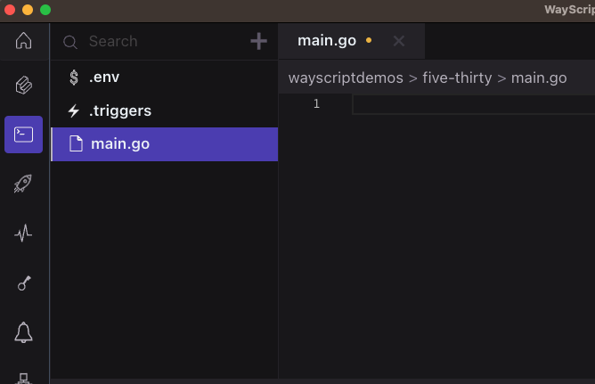
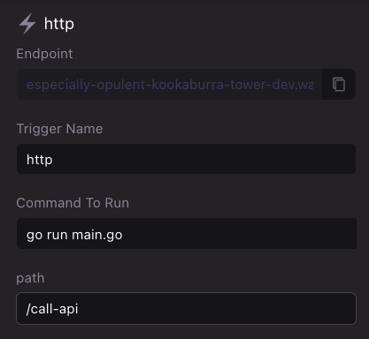

# Build golang microservices

WayScript allows you to configure your Lair to build an serverless API endpoint in minutes.

### Install Dependencies

For HTTP trigger go functionality, this github repo needs to be added to your lair:

[https://github.com/wayscript/wayscript-golang](https://github.com/wayscript/wayscript-golang)

### Create `main.go`

Use the boilerplate code below to create an `main.go` file in your Lair’s root directory. See [File system](../../platform/lairs/file-system/) for more details on how to manipulate files in your workspace file system.

<figure><figcaption><p>Create a file called main.go</p></figcaption></figure>

#### Boilerplate `main.go`

```go
package main

import (
	"fmt"

	wayscript "github.com/wayscript/wayscript-golang/wayscript"
)

func main() {
	// Get payload for request event
	event, err := wayscript.GetEvent()
	if err != nil {
		fmt.Println(err)
	}
	//Parse header and request body from request payload
	fmt.Println(event.Data.Headers)
	fmt.Println(event.Data.Data)

	// Create the data to send back to the HTTP trigger response
	var jsonData = []byte(`
		{
			"data": "Hello World",
			"headers": {"header":"value"},
			"status_code": 200
		}
	`)
	triggerString, err := wayscript.SendHttpTriggerResponse(jsonData)
	if err != nil {
		fmt.Println(err)
	} else {
		fmt.Println(triggerString)
	}

}
```

### Configure `http` trigger

Open your Lair’s [Triggers Panel](../../platform/lairs/triggers.md) and add a new `http` trigger. Create a name for your trigger and input the following run command. See [Triggers](../../platform/lairs/triggers.md) for more details.

```bash
go run main.go
```

<figure><figcaption><p>Example HTTP Trigger Setup</p></figcaption></figure>

`Trigger Name` - You can create any name you want for organization.&#x20;

`Command To Run` - The `Unix` command to run your code.

`Path` - If you want multiple HTTP Triggers in the same lair, you can create custom URL paths. For example you can have `<Endpoint_URL>/call-api` and then another HTTP Trigger with the URL `<Endpoint_URL>/do-something-else`

### Test your API in development environment

Navigate to the `*.wayscript.cloud` endpoint generated by your `http` trigger to see your simple API in action!

### Cloneable Template


For a cloneable HTTP trigger Golang template, please visit our [public lair](https://app.wayscript.com/lairs/90fd7db8-fe87-4cee-b9f0-cc464bb7b1ba/public/).


### Deploy to production environment

Once you have finished testing, press “Deploy” to create a production environment for your API. Select `<Lair_name>.prod` in the Lair selector menu and view the `http` trigger to access your API’s production endpoint. See [Hosted environments](../../platform/lairs/deployments.md) for more details.


By default, your Lair's endpoints are protected against unauthenticated requests. See [endpoints.md](../../platform/lairs/endpoints.md "mention") on how to public expose your endpoints or authenticate using your application key.

