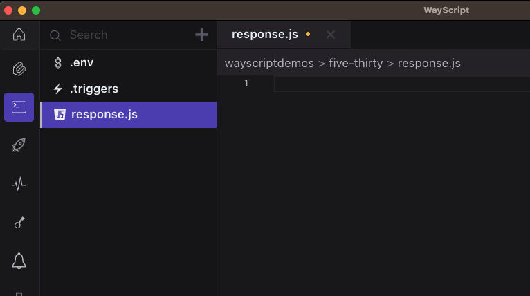
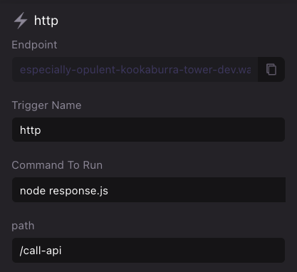

# Build JavaScript microservices

WayScript allows you to configure your [Lair](../../platform/lairs/) to build an serverless API endpoint in minutes.

### Create `response.js`

Use the boilerplate code below to create an `response.js` file in your Lair’s root directory. See [File system](../../platform/lairs/file-system.md) for more details on how to manipulate files in your workspace file system.

<figure><figcaption><p>Create a file called response.js</p></figcaption></figure>

#### Boilerplate `response.js`

```javascript
// Returns json response to http trigger
const wayscript = require("wayscript");

// Get payload for request event
let requestPayload = wayscript.context.getEvent()
// Parse header and request body from request payload
let requestHeader = requestPayload.data.headers
let requestBody = requestPayload.data.data

// Specify response payload
let data = {"hello": "world"};
let headers = {"content-type": "application/json"};
let status_code = 200;

// sends reponse
wayscript.http_trigger.sendResponse(data, headers, status_code);
```


See our [SDK](../../using-wayscript/sdk/) for more information on custom WayScript packages


#### `Created a file called package.json`

```javascript
{
    "dependencies": {
      "wayscript": "^0.3.0"
    }
  }
```

### Configure `http` trigger

Open your Lair’s [Triggers Panel](../../platform/lairs/triggers.md) and add a new `http` trigger. Create a name for your trigger and input the following run command. See [Triggers](../../platform/lairs/triggers.md) for more details.

```bash
node response.js
```

<figure><figcaption><p>Example HTTP Trigger Setup</p></figcaption></figure>

`Trigger Name` - You can create any name you want for organization.&#x20;

`Command To Run` - The `Unix` command to run your code.

`Path` - If you want multiple HTTP Triggers in the same lair, you can create custom URL paths. For example you can have `<Endpoint_URL>/call-api` and then another HTTP Trigger with the URL `<Endpoint_URL>/do-something-else`

### Test your API in development environment

Navigate to the `*.wayscript.cloud` endpoint generated by your `http` trigger to see your simple API in action!

### Deploy to production environment

Once you have finished testing, press “Deploy” to create a production environment for your API. Select `<Lair_name>.prod` in the Lair selector menu and view the `http` trigger to access your API’s production endpoint. See [Hosted environments](../../platform/lairs/deployments.md) for more details.


By default, your Lair's endpoints are protected against unauthenticated requests. See [endpoints.md](../../platform/lairs/endpoints.md "mention") on how to public expose your endpoints or authenticate using your application key.

