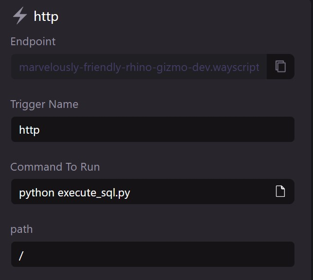

# Build a Microservice (SQL)

WayScript allows you to configure your Lair to build an serverless API endpoint in minutes.

### Create `execute-sql.py`

Use the boilerplate code below to create an `execute-sql.py` file in your Lair’s root directory. See [File system](../../platform/lairs/file-system.md) for more details on how to manipulate files in your workspace file system.


#### Boilerplate `response.js`

```javascript
import os
import mysql.connector
from wayscript import context
from wayscript.triggers import http_trigger

# Setup:
# These values will need to be replaced with values from your own database
# you can usually find these values in your database settings
# Please reference the Docs of your DB service for more specifics around your DB credentials
mydb = mysql.connector.connect(
  host='lcpbq9az4jklobvq.cbetxkdyhwsb.us-east-1.rds.amazonaws.com',
  user='srwmp6imz2v547os',
  password=os.environ.get('db_password'),
  port=3306,
  database='c9h0n4i2bk671ofb'
)

# Perform your SQL action here.
# depending on the operation your code may change
# https://dev.mysql.com/doc/connector-python/en/connector-python-examples.html
sql = "SELECT * FROM earnings;"
mycursor = mydb.cursor()
mycursor.execute(sql)
myresult = mycursor.fetchall()
print(myresult)

# These results can be passed via the HTTP response if desired.
# In this template we are just returning the stand HTTP response via the WayScript Docs
# https://docs.wayscript.com/quickstart-webhook-microservice/build-an-api

# Get payload for request event
request_payload = context.get_event()

# Parse header and request body from request payload
request_header = request_payload['data'].get('headers')
request_body = request_payload['data'].get('data')

# Specify response payload
response_payload = {"hello": "world"}
response_headers = {"content-type": "application/json"}
status_code = 200

# Send response
http_trigger.send_response(data=response_payload, headers=response_headers, status_code=status_code)

```

#### &#x20;`requirements.txt`

```
mysql-connector-python
wayscript
```


Be sure to install your requirements.txt!

`pip install -r requirements.txt`


#### `.secrets`

A secret is called from the above python code. This secret needs to be named `db_password` (or altered in the code above to match whatever you name your secret.) This should be your database's password.

### Configure `http` trigger

Open your Lair’s [Triggers Panel](../../platform/lairs/triggers.md) and add a new `http` trigger. Create a name for your trigger and input the following run command. See [Triggers](../../platform/lairs/triggers.md) for more details.

```bash
python execute-sql.py
```


If you are using the WayScript X desktop app, you must press "Push" to sync your new and modified files to remote (see [file-system.md](../../platform/lairs/file-system.md "mention") or more details).


### Test your API in development environment

Navigate to the `*.wayscript.cloud` endpoint generated by your `http` trigger to see your simple API in action!

<figure><figcaption></figcaption></figure>

### Deploy to production environment

Once you have finished testing, press “Deploy” to create a production environment for your API. Select `<Lair_name>.prod` in the Lair selector menu and view the `http` trigger to access your API’s production endpoint. See [Hosted environments](../../platform/lairs/deployments.md) for more details.


By default, your Lair's endpoints are protected against unauthenticated requests. See [endpoints.md](../../platform/lairs/endpoints.md "mention") on how to public expose your endpoints or authenticate using your application key.

