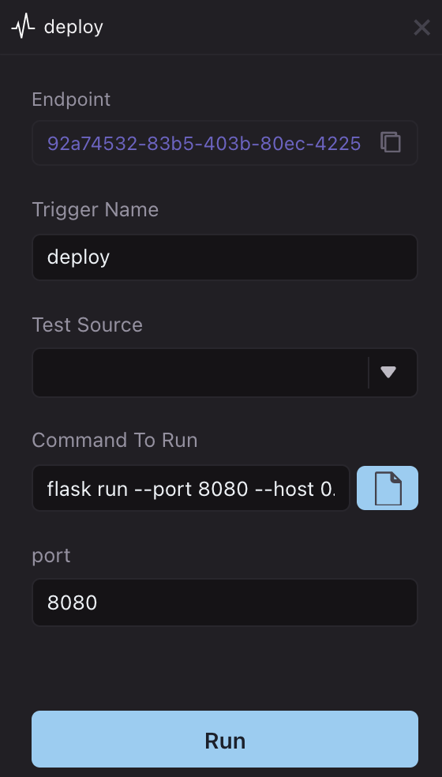

# Host a Flask server

WayScript allows you to configure your Lair to host a Flask app in minutes.

### Create `app.py` or load Flask files

Use the boilerplate code below to create a `app.py` file in your Lair’s root directory. Or if you have an existing Flask project, copy or clone your project files into your Lair’s directory. See [File system](../building-tools/file-system.md) for more details on how to manipulate files in your workspace file system.


#### Boilerplate `app.py`

```python
# my-lair-a > app.py

from flask import Flask

app = Flask(__name__)

@app.route('/')
def hello_world():
    return 'Hello World'

if __name__ == '__main__':
    app.run()
```

### Add packages to `requirements.txt`

Create a `requirements.txt` file in your Lair’s root directory and specify the `flask` package. You can also specify any additional dependencies your app requires. See [Hosted environments ](../managing-tools/environments.md)for more details.

```
# my-lair > requirements.txt
flask==2.0.1
```

### Configure `deploy` trigger

Open your Lair’s `.triggers` file and add a new `deploy` trigger. Create a name for your trigger and input the following run command and port number `8080` (or modified command and port number based on your app requirements). See [Triggers](../building-tools/triggers.md) for more details.

```
flask run --port 8080 --host 0.0.0.0
```

### Test app in development environment

Press “Run” to execute the run command and start your web server process (see [Processes](../testing-and-visiblity/processes.md) for more details). Navigate to the `*.wayscript.cloud` endpoint generated to see your Flask app in action!




Set your `FLASK_ENV=development` to enable hot reload of your server process when modifying your app’s files.


### Deploy to production environment

Once you have finished testing, press “Deploy” to create a production environment for your Flask app. Select `<Lair_name>.prod` in the Lair selector menu and view the `on deploy` trigger to access your app’s production endpoint. See [Hosted environments](../managing-tools/environments.md) for more details.
