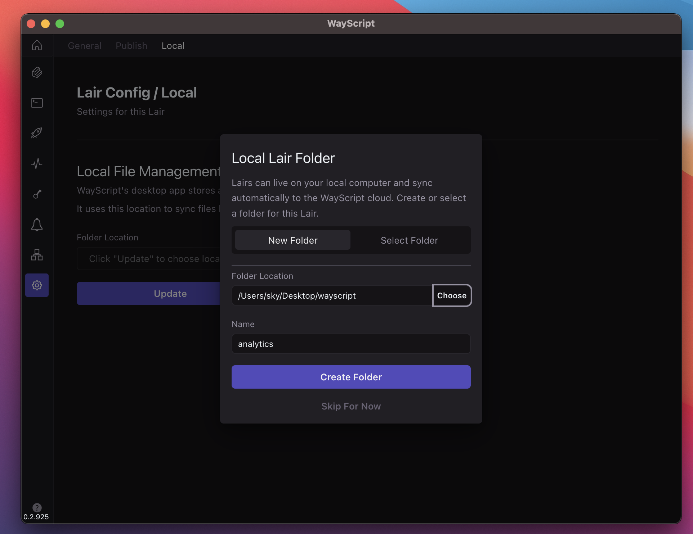
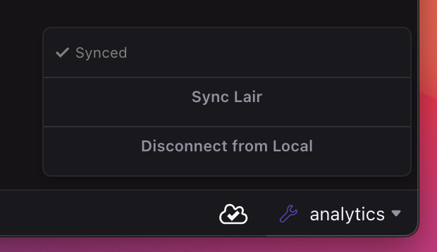

# Working with a Local Directory

### Connecting to Local Directory

When you open the Lair development tab, if the lair is not already connected to a local directory, you will be prompted with a modal to do so. You can always "Skip For Now". Otherwise, you have the options:

* Create a new folder
  * Files in Lair's development environment are downloaded to seed this new folder
* Select a folder
  * Files in Selected folder will replace what exists in the Lair's development environment


You set up or update your local directory connection anytime from the Lair Configuration Tab


<figure><figcaption></figcaption></figure>

### Local Development

Once your Lair is connected to a local directory, you are free edit your files locally however you like. Use your favorite IDE, or just a terminal command.

### Syncing Changes

Changes are synced in both directions as files are updated in the local directory or directly in the hosted Lair environment. In any case where it's not certain what the most recent change is, the local directory serves as the source of truth.

1. Change initiated locally. WayScript watches for changes to the local directory, and when change events are fired, the same changes are sent to the hosted Lair environment
2. When files are changed in the hosted Lair environment, WayScript sends notifications to the Application. If these changes are newer than latest local changes, the local directory will be updated

#### Auto-Sync

Changes will be synced in the background without any user action required. The sync status indicator will display when a sync is in progress and which files are being updated.&#x20;

#### Manual Sync

If you see a sync error, syncing seems to be stuck, or something otherwise doesn't look right. Try manually pressing the 'Sync Lair' button on the sync menu.

### Disconnecting your Lair

If you want changes to stop syncing between your Lair and connected local directory, do the following:

1. Navigate to the Development tab (hotkey `L then E)`
2. Open the Sync menu from the bottom toolbar
3. Select "Disconnect From Local"

<figure><figcaption></figcaption></figure>
